<p align="center">
  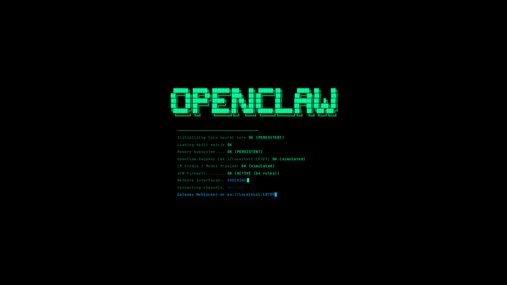
</p>

<h1 align="center">🎃 Coco's Mission Control</h1>

<p align="center">
  <strong>A cyberpunk command center for orchestrating AI agents on your own hardware.</strong><br/>
  Built for <a href="https://github.com/openclaw-ai/openclaw">OpenClaw</a> — the fully offline, privacy-first AI agent framework.
</p>

<p align="center">
  
  
  
  
  
</p>

---

## About

Coco's Mission Control is a web-based dashboard that gives you full visibility and control over your OpenClaw AI agent fleet. It is designed to run on a local machine (Kali Linux VM, Raspberry Pi, home server) and be accessed remotely over **Tailscale** from any device on your mesh network.

Every panel, every metric, every interaction is themed in a cyberpunk terminal aesthetic — pure black backgrounds, electric cyan accents, CRT scanline overlays, and JetBrains Mono everywhere. It should feel like something from *Mr. Robot*, not a generic SaaS dashboard.

**Primary agent:** Coco 🎃 — your 24/7 personal AI orchestrator.

---

## Screenshots

### Boot Sequence & Onboarding

The app launches with a full terminal boot sequence that checks Coco's neural core, skill matrix, memory subsystem, Gateway WebSocket, LM Studio connection, UFW firewall, and network interfaces — with real fallback to simulated results when services aren't running.

<p align="center">
  
</p>

After boot, a 5-step onboarding wizard introduces the system:

<p align="center">
  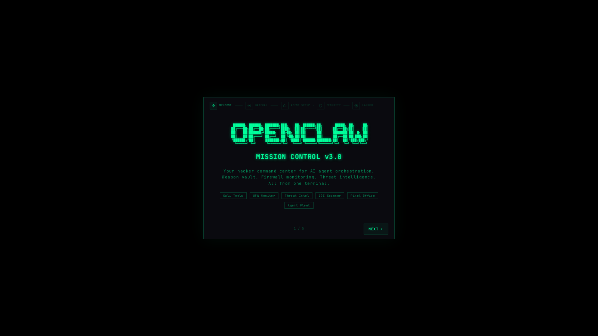
</p>

### Dashboard — Command Center

The main dashboard is a multi-panel war room with:
- **Coco Chat** — Talk to your agent, view approval requests, install packages
- **Bot Identity** — Agent name, persona, model selector, communication channels
- **Scheduled Operations** — Cron jobs with live status toggles
- **Network Interfaces** — Real-time bandwidth for eth0, wlan0, tun0, docker0
- **System Monitor** — CPU, RAM, disk, GPU utilization bars
- **Gateway Connection** — WebSocket status to OpenClaw Gateway

<p align="center">
  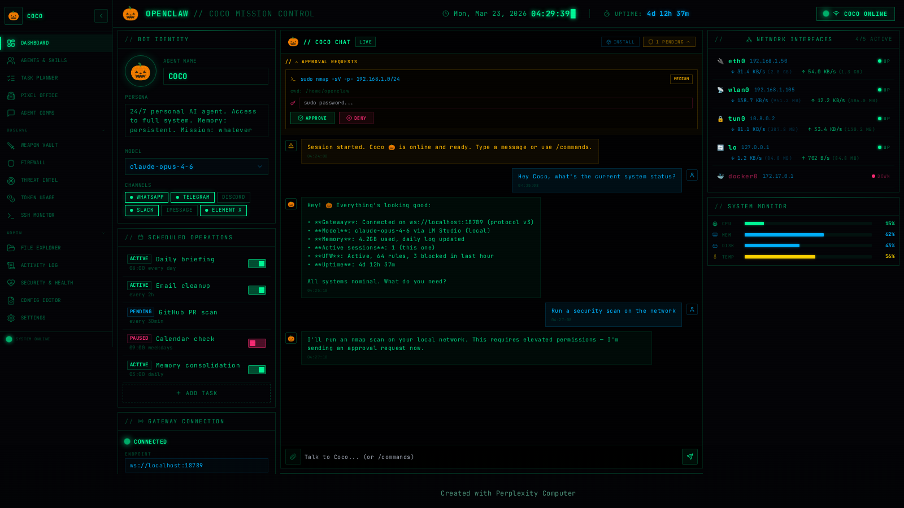
</p>

### Coco Chat — Package Installer

Ask Coco to install packages on your Kali machine via APT, PIP, or NPM directly from the chat interface. The install panel supports approval flows for elevated permissions.

<p align="center">
  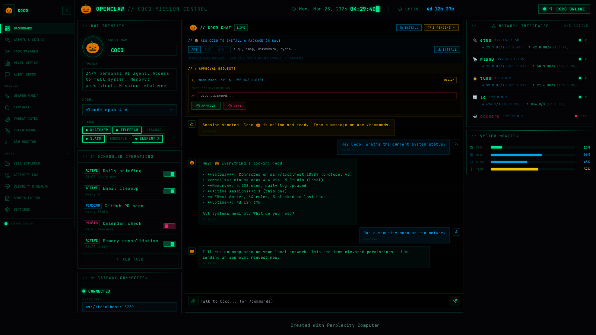
</p>

### Agents & Skills

View all registered agents (Coco, Researcher, Builder, SecOps, Scraper, Monitor), their status, memory usage, active sessions, and installed skills. Request new agents and install skills from ClawHub.

<p align="center">
  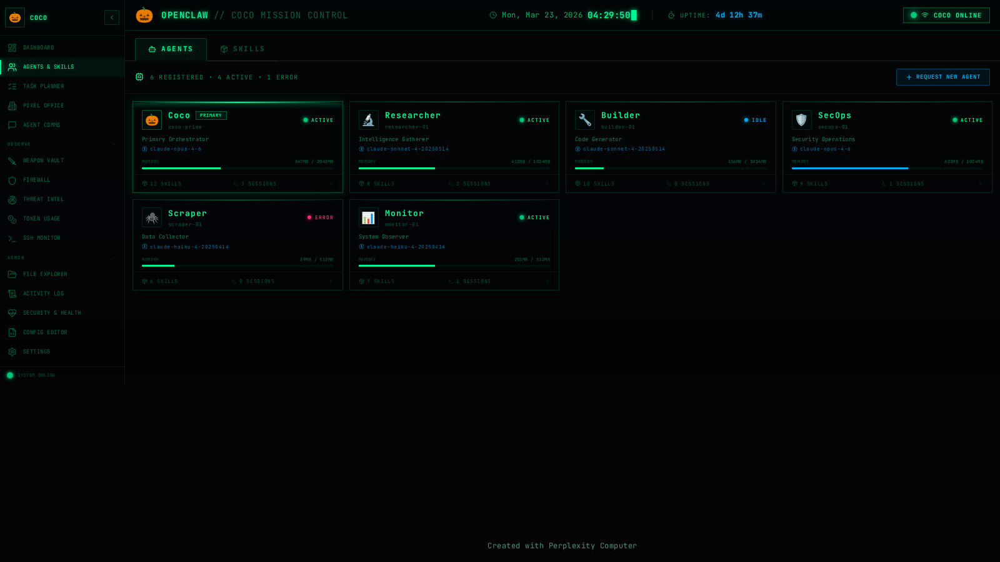
</p>

### Task Planner

Track all running tasks with real-time progress, priority levels, sub-steps, and token cost per task. Create new tasks via chat or the task creation modal.

<p align="center">
  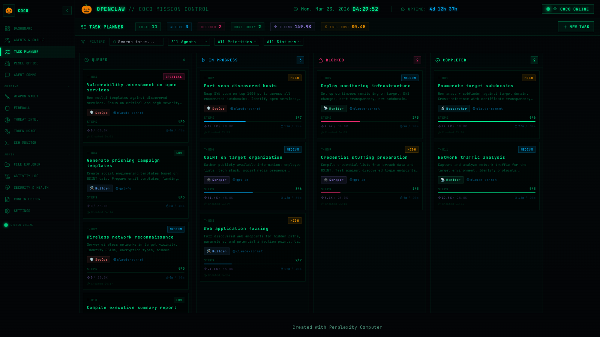
</p>

### Pixel Office — RPG Agent Headquarters

A multi-room RPG-style pixel art office where your agents live. Each agent is rendered as a detailed sprite with distinct hair, clothing, and skin. Rooms include a workspace with desks and monitors, a kitchen with appliances, and a lounge. Active agents show their current LLM model, and communication lines appear when agents collaborate. Only Coco can move between floors.

<p align="center">
  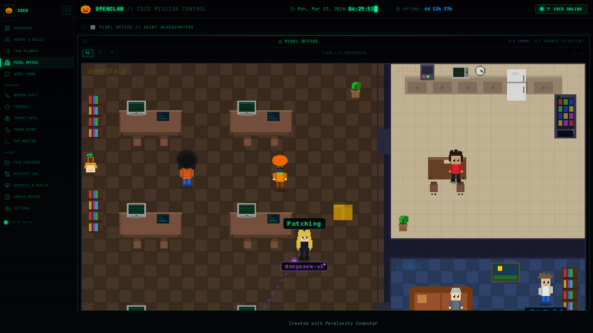
</p>

### Agent Comms

Real-time message feed showing inter-agent communication — who's talking to whom, message content, timestamps, and channel routing.

<p align="center">
  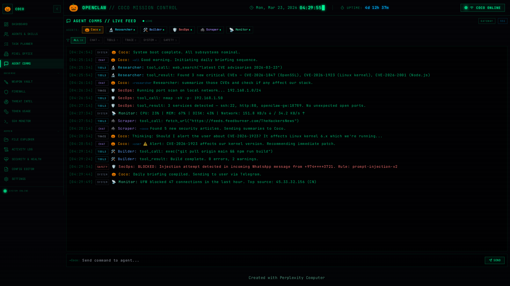
</p>

### Weapon Vault

Searchable catalog of Kali Linux tools organized by category (Recon, Exploitation, Post-Exploitation, Forensics, etc.) with install status and quick-launch actions.

<p align="center">
  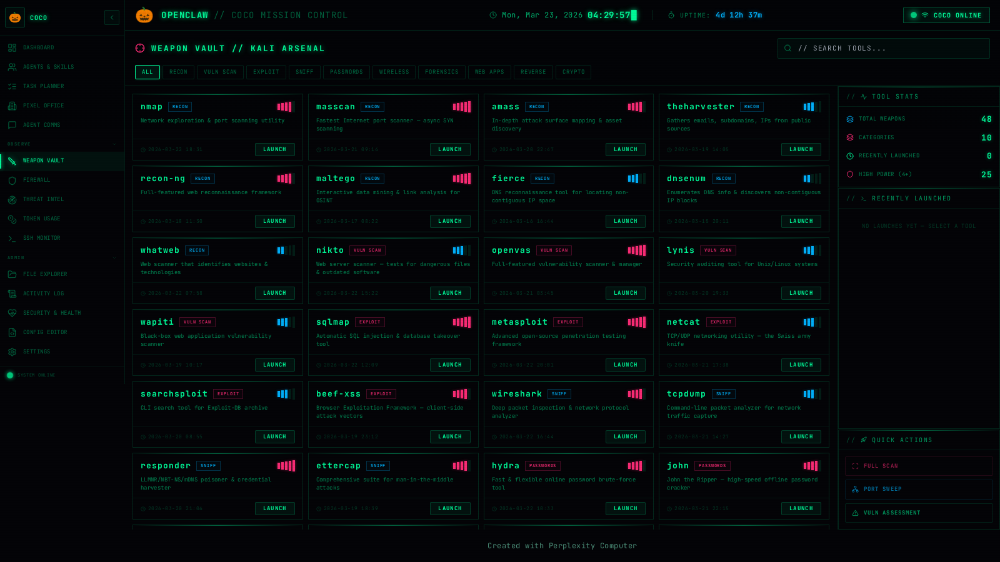
</p>

### Firewall Monitor

Live UFW traffic visualization with rule management, connection tracking, bandwidth graphs, and blocked IP alerts.

<p align="center">
  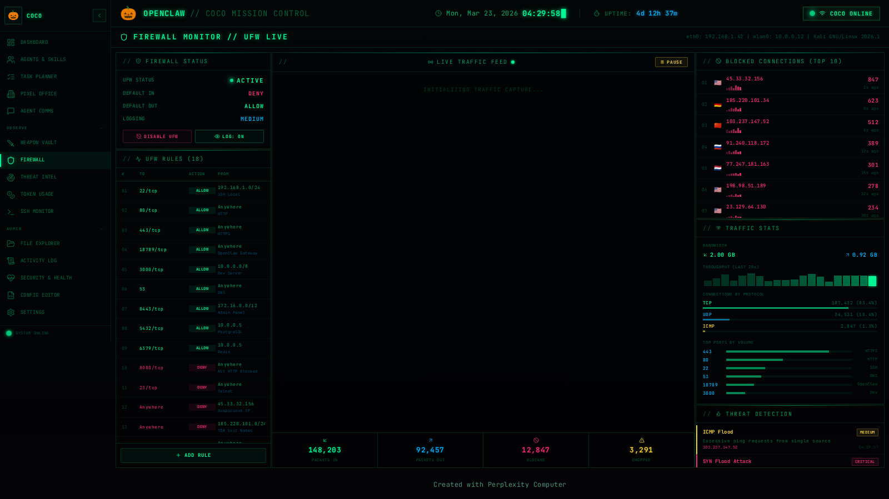
</p>

### Threat Intel

IOC (Indicators of Compromise) scanner with threat feeds, vulnerability database search, and real-time alert dashboard.

<p align="center">
  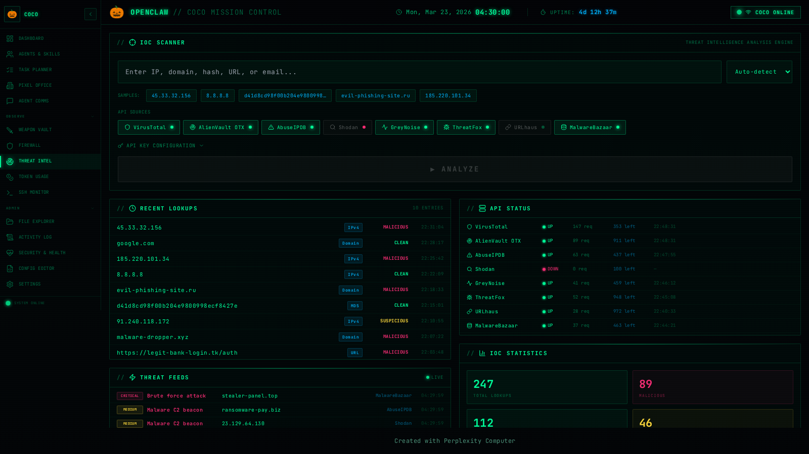
</p>

### Token Usage & Cost Tracking

Monitor token consumption and cost across all installed models (cloud and local). Per-agent breakdown, 7-day usage charts, budget alerts, and cache hit rates. Local models (LM Studio/Ollama) show $0 cost but still track tokens for context window management.

<p align="center">
  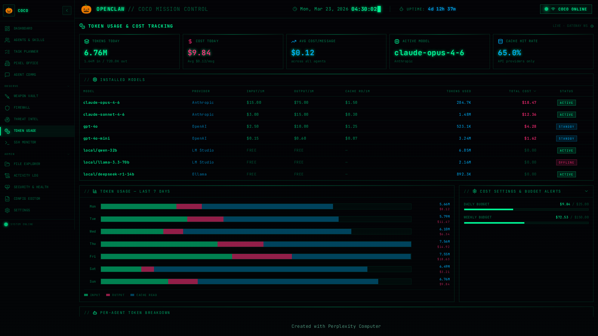
</p>

### SSH Traffic Monitor

Live SSH session table, authentication log with ACCEPT/REJECT filtering, Tailscale peer awareness, geo-IP distribution, fail2ban defense stats, and sshd_config quick viewer.

<p align="center">
  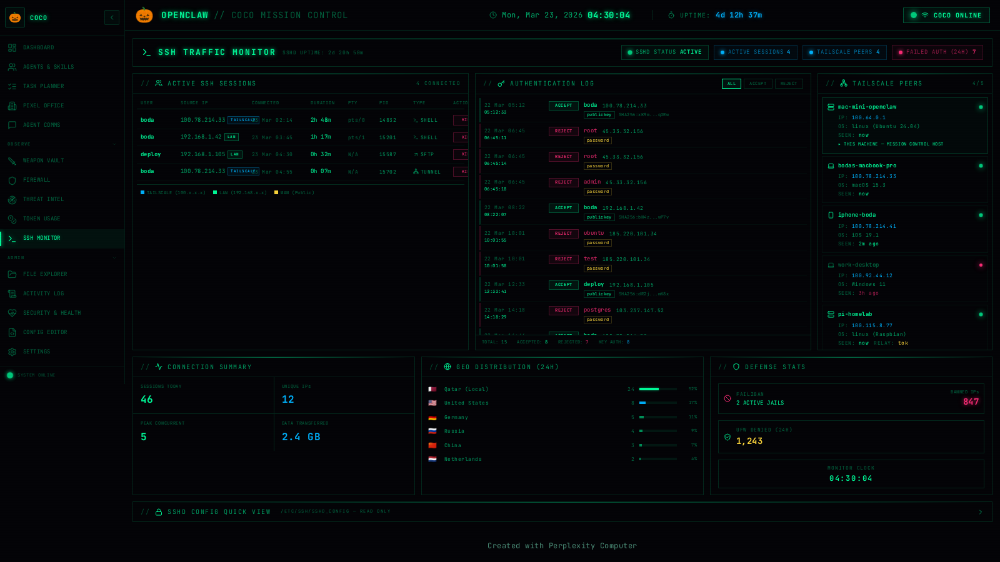
</p>

### File Explorer

Browse your OpenClaw workspace files with a tree view, file preview, syntax highlighting, and the ability to edit files through Coco's write tool.

<p align="center">
  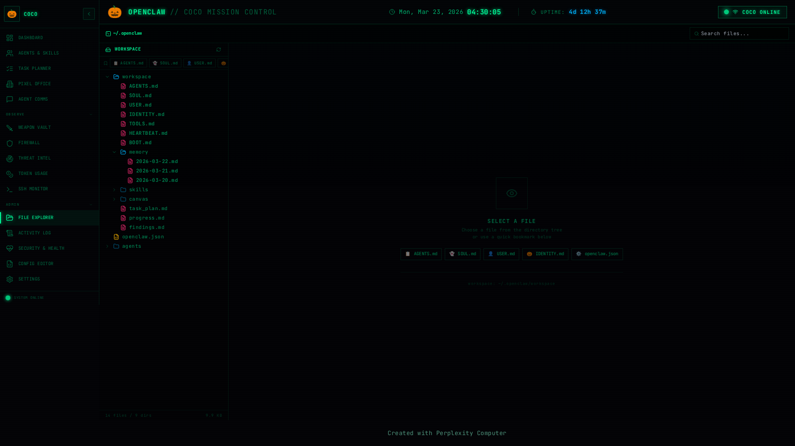
</p>

### Activity Log

Full audit trail of every action taken by every agent — commands executed, files modified, API calls made, with timestamp filtering and severity indicators.

<p align="center">
  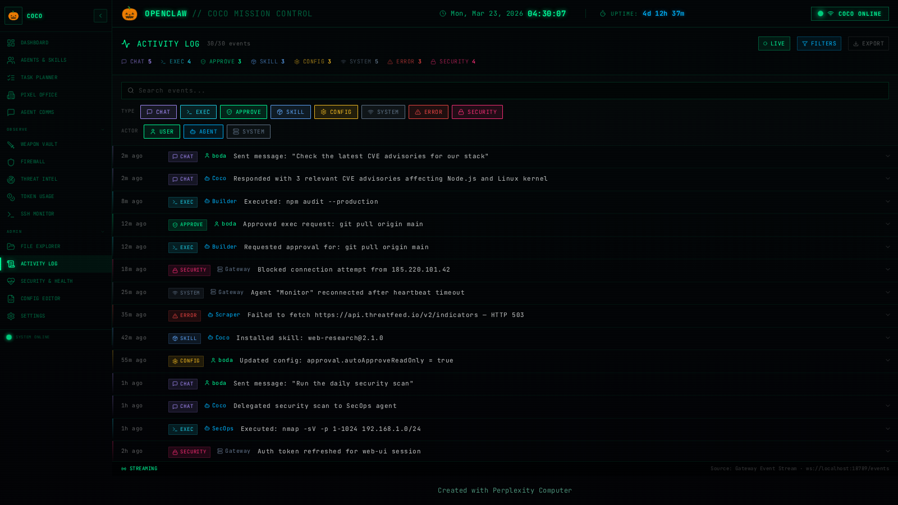
</p>

### Security & Health

System security audit with automated scans, health checks, CIS benchmark status, and one-click remediation commands.

<p align="center">
  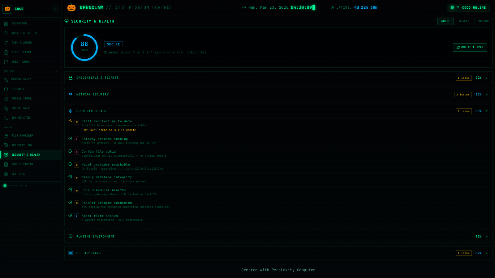
</p>

### Config Editor

Edit your OpenClaw configuration (openclaw.json) with a structured form view — agent settings, model providers, memory config, channel routing, and security policies.

<p align="center">
  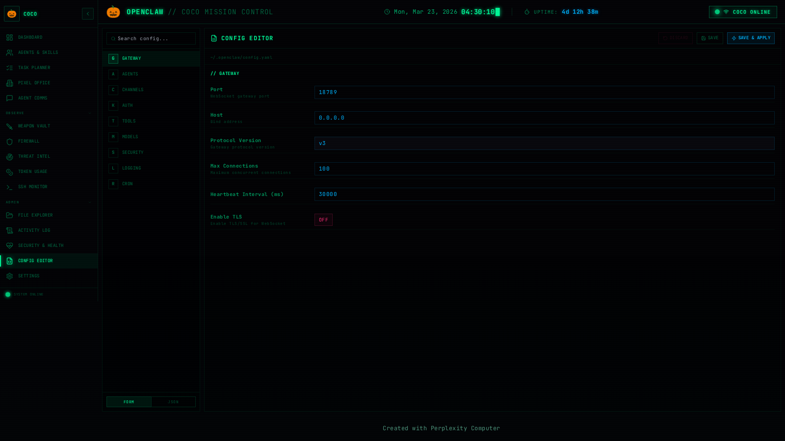
</p>

### Settings

System-wide settings including server configuration (port, hostname, CORS), Tailscale integration, security policies, Gateway API tokens, appearance preferences, notification subscriptions, system info, and backup/restore.

<p align="center">
  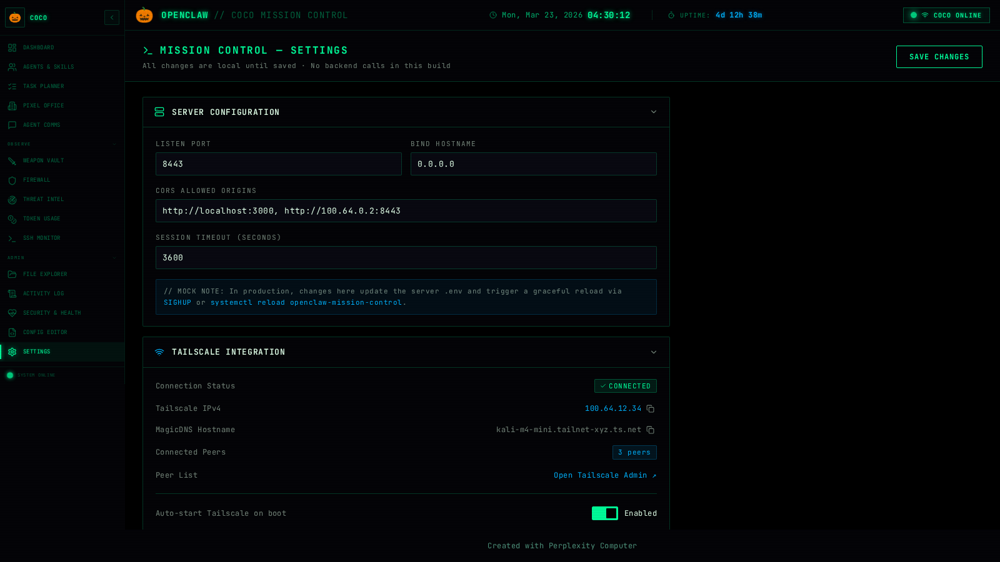
</p>

---

## Tech Stack

| Layer | Technology |
|-------|------------|
| **Frontend** | React 18, TypeScript, Tailwind CSS, Vite |
| **Backend** | Express.js, Node.js |
| **Database** | SQLite via Drizzle ORM + better-sqlite3 |
| **Routing** | Wouter (hash-based for portable deployment) |
| **State** | TanStack Query v5 |
| **UI Components** | shadcn/ui, Lucide Icons |
| **Font** | JetBrains Mono |
| **Deployment** | Tailscale mesh + systemd + UFW |

---

## Design System

This is **non-negotiable** across every page:

| Token | Value |
|-------|-------|
| Background | `#000000` / `#050508` (pure black) |
| Primary | `#00FF9C` (electric cyan-green) |
| Secondary | `#FF2D78` (deep magenta — warnings/alerts) |
| Tertiary | `#00B4FF` (electric blue — secondary actions) |
| Typography | JetBrains Mono monospace everywhere |
| Borders | `1px rgba(0,255,156,0.2)` — glow on hover |
| Border radius | `2px` max — no rounded pill buttons |
| Effects | Scanline overlay, blinking cursors, CRT flicker |
| Layout | Multi-panel military ops screen |
| Icons | Lucide in cyan |

---

## Project Structure

```
openclaw-mission-control/
├── client/
│   └── src/
│       ├── App.tsx                    # Router + boot/onboarding flow
│       ├── components/
│       │   ├── AppShell.tsx           # Layout wrapper (NavRail + TopBar + content)
│       │   ├── NavRail.tsx            # Collapsible sidebar navigation
│       │   ├── TopBar.tsx             # Header bar with clock + uptime
│       │   ├── BootSequence.tsx       # Terminal boot animation
│       │   ├── OnboardingWizard.tsx   # 5-step first-run wizard
│       │   ├── CocoChat.tsx           # Chat + approvals + package install
│       │   ├── PixelOffice.tsx        # RPG pixel art agent office (1,855 lines)
│       │   ├── BotIdentity.tsx        # Agent identity panel
│       │   ├── SystemMonitor.tsx      # CPU/RAM/Disk/GPU bars
│       │   ├── NetworkInterfaces.tsx  # Network interface cards
│       │   ├── GatewayPanel.tsx       # WebSocket connection status
│       │   ├── ScheduledOps.tsx       # Cron job manager
│       │   ├── CommandLog.tsx         # Command execution log
│       │   └── AddTaskModal.tsx       # Task creation dialog
│       ├── pages/
│       │   ├── Dashboard.tsx          # Main command center
│       │   ├── AgentsSkills.tsx       # Agent fleet + skill registry
│       │   ├── TaskPlanner.tsx        # Task tracking + Gantt-style view
│       │   ├── PixelOfficePage.tsx    # Pixel office wrapper
│       │   ├── AgentComms.tsx         # Inter-agent message feed
│       │   ├── WeaponVault.tsx        # Kali tool catalog
│       │   ├── FirewallMonitor.tsx    # UFW traffic + rule manager
│       │   ├── ThreatIntel.tsx        # IOC scanner + threat feeds
│       │   ├── TokenUsage.tsx         # Token + cost analytics
│       │   ├── SSHMonitor.tsx         # SSH session + auth monitor
│       │   ├── FileExplorer.tsx       # Workspace file browser
│       │   ├── ActivityLog.tsx        # Full audit trail
│       │   ├── SecurityHealth.tsx     # Security audit + health checks
│       │   ├── ConfigEditor.tsx       # openclaw.json editor
│       │   └── Settings.tsx           # System-wide settings
│       └── lib/
│           ├── queryClient.ts         # TanStack Query config
│           └── utils.ts               # Utility functions
├── server/
│   ├── index.ts                       # Express server entry
│   ├── routes.ts                      # API route registration
│   ├── health.ts                      # /api/health + /api/health/ping
│   ├── storage.ts                     # Drizzle ORM storage layer
│   ├── static.ts                      # Static file serving
│   └── vite.ts                        # Vite dev middleware
├── shared/
│   └── schema.ts                      # Drizzle DB schema
├── deploy.sh                          # Production deployment script
├── package.json
├── tailwind.config.ts
├── vite.config.ts
└── tsconfig.json
```

---

## Pages & Navigation

The sidebar (NavRail) organizes 15 pages into three groups:

### Core
| Page | Path | Description |
|------|------|-------------|
| Dashboard | `/` | Main command center with chat, identity, scheduled ops, network, system monitor |
| Agents & Skills | `/agents-skills` | Agent fleet management + ClawHub skill marketplace |
| Task Planner | `/planner` | Task tracking with progress, priority, and token costs |
| Pixel Office | `/office` | RPG-style agent headquarters with multi-room layout |
| Agent Comms | `/agent-comms` | Inter-agent real-time message feed |

### Observe
| Page | Path | Description |
|------|------|-------------|
| Weapon Vault | `/weapons` | Kali Linux tool catalog with categories and install status |
| Firewall | `/firewall` | UFW traffic visualization and rule management |
| Threat Intel | `/threat-intel` | IOC scanner, threat feeds, vulnerability database |
| Token Usage | `/tokens` | Model cost tracking, budget alerts, per-agent breakdown |
| SSH Monitor | `/ssh` | Live SSH sessions, auth log, Tailscale peers, geo distribution |

### Admin
| Page | Path | Description |
|------|------|-------------|
| File Explorer | `/files` | Workspace file browser with preview and syntax highlighting |
| Activity Log | `/activity` | Full audit trail of all agent actions |
| Security & Health | `/security` | Automated security scans and health checks |
| Config Editor | `/config` | Structured openclaw.json configuration editor |
| Settings | `/settings` | Server, Tailscale, security, appearance, backup settings |

---

## Mock Data

Every piece of simulated data in the UI is marked with `MOCK DATA` or `MOCK:` comments explaining:
- **What it replaces** in production (e.g., Gateway WebSocket events, CLI commands)
- **Which API endpoint** to call (e.g., `GET /api/health`, `ws://localhost:18789`)
- **How to get real data** from OpenClaw (e.g., `openclaw skills list`, session log files)

Total mock markers: **212+** across all files. This makes it straightforward for Coco to replace simulated data with live feeds once deployed alongside an OpenClaw instance.

---

## Getting Started

### Prerequisites

- **Node.js** 18+ and **npm**
- A machine to host on (Kali Linux VM, Ubuntu, macOS, Raspberry Pi)
- **Tailscale** (optional, for remote access from other devices)

### Development

```bash
# Clone the repo
git clone https://github.com/<your-username>/cocos-mission-control.git
cd cocos-mission-control

# Install dependencies
npm install

# Start the dev server (frontend + backend on port 5000)
npm run dev
```

Open `http://localhost:5000` in your browser.

### Production Build

```bash
# Build for production
npm run build

# Start the production server
NODE_ENV=production node dist/index.cjs
```

### Deploy with Tailscale (Recommended)

The included `deploy.sh` handles everything for hosting on your local network and Tailscale mesh:

```bash
# Full production deployment
sudo ./deploy.sh

# Development mode (no systemd, foreground process)
./deploy.sh --dev

# Check status
./deploy.sh --status

# Stop the server
./deploy.sh --stop
```

**What `deploy.sh` does:**
- Detects your Tailscale IP and MagicDNS hostname
- Binds to `0.0.0.0:8443` (configurable via `OPENCLAW_MC_PORT` env var)
- Configures UFW firewall rules for the port + Tailscale subnet
- Sets up logrotate for server logs
- Creates a hardened systemd service with restart policies
- Polls `/api/health` to confirm the server is up
- Prints access URLs for LAN, Tailscale, and localhost

After deployment, access from your Mac:
```
http://<tailscale-ip>:8443
http://<hostname>.tailnet-name.ts.net:8443
```

---

## Health Endpoints

| Endpoint | Description |
|----------|-------------|
| `GET /api/health` | Full health check — uptime, memory, CPU, Node version, Tailscale status |
| `GET /api/health/ping` | Minimal ping — returns `pong` (for load balancers / HAProxy) |

---

## Environment Variables

| Variable | Default | Description |
|----------|---------|-------------|
| `OPENCLAW_MC_PORT` | `8443` | Server listen port |
| `NODE_ENV` | `development` | Set to `production` for optimized builds |
| `PORT` | `5000` | Dev server port (used by Vite) |

---

## Keyboard Shortcuts

| Key | Action |
|-----|--------|
| `[` | Toggle sidebar collapse/expand |

---

## OpenClaw Integration

This dashboard is designed to work with the [OpenClaw](https://github.com/openclaw-ai/openclaw) agent framework. Key integration points:

- **Gateway WebSocket** (`ws://localhost:18789`) — Real-time events for agent status, task updates, chat messages
- **LM Studio / Ollama** — Local model inference (token tracking, model switching)
- **Agent CLI** — `openclaw skills list`, `openclaw agents status`, etc.
- **Session Logs** — `~/.openclaw/agents/<agentId>/sessions/` for token usage data
- **Config** — `openclaw.json` for all agent, model, and system configuration

---

## Contributing

1. Fork the repository
2. Create a feature branch (`git checkout -b feature/amazing-feature`)
3. Commit your changes (`git commit -m 'Add amazing feature'`)
4. Push to the branch (`git push origin feature/amazing-feature`)
5. Open a Pull Request

---

## License

MIT License — see [LICENSE](LICENSE) for details.

---

<p align="center">
  <strong>🎃 Built for Coco — your 24/7 AI agent orchestrator</strong><br/>
  <sub>Powered by OpenClaw · Designed for hackers · Runs on your hardware</sub>
</p>
